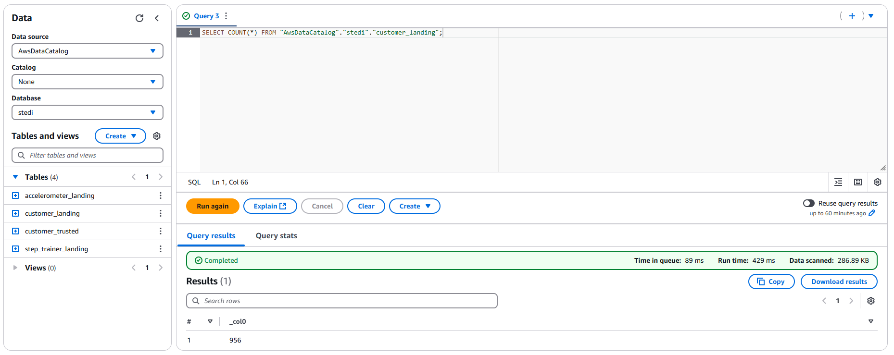
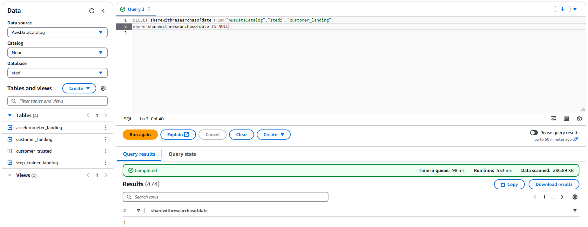
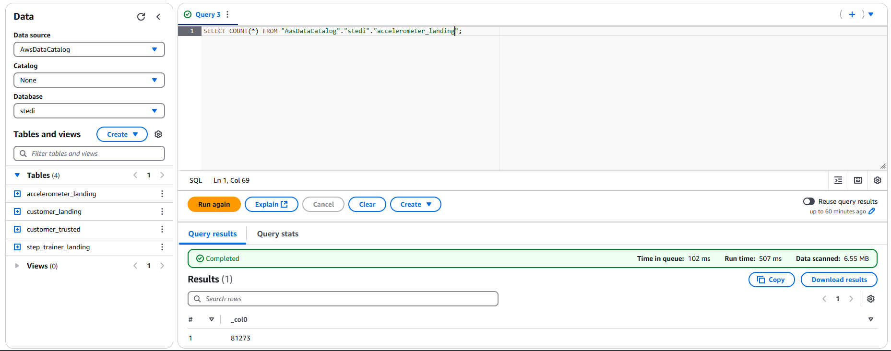
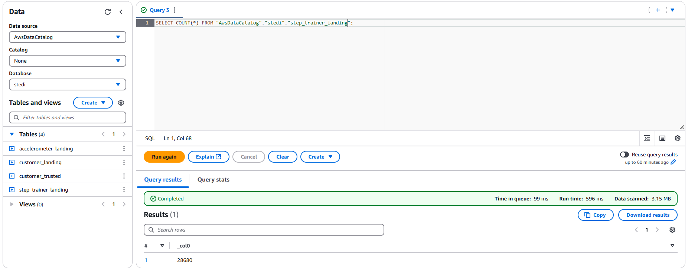
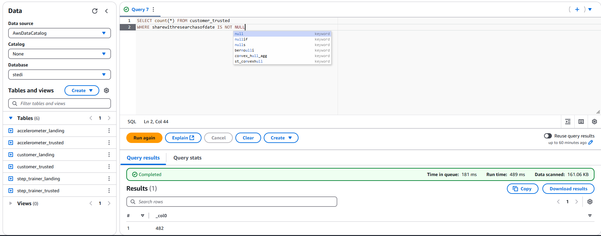
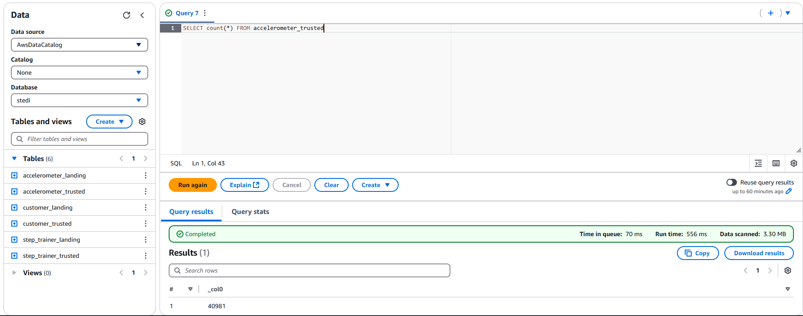
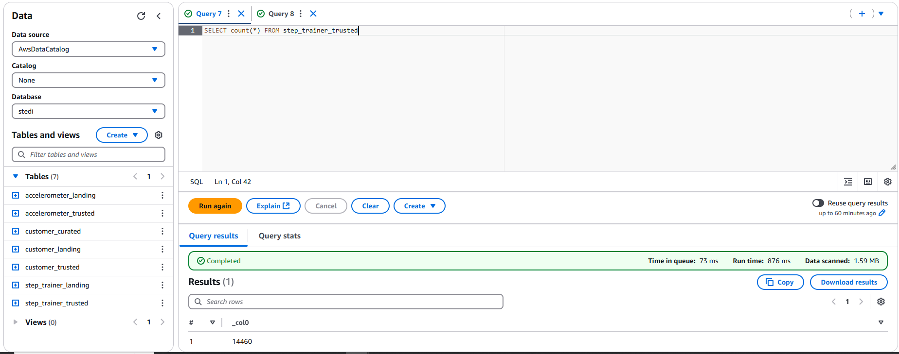
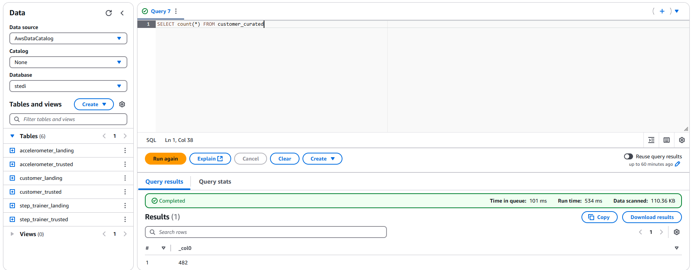
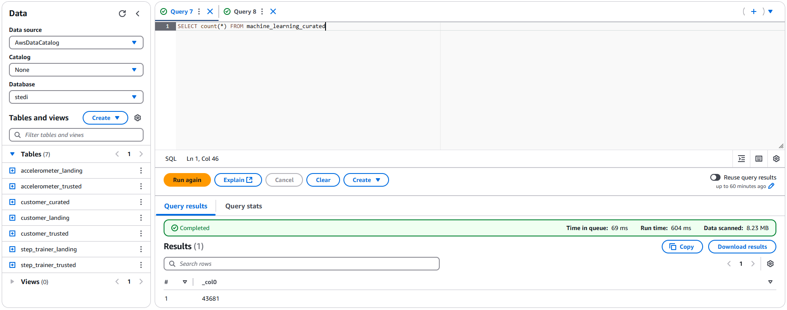

# STEDI-Human-Balance-Analytics
Public repo for WGU/Udacity D609 "Data Analytics at Scale" AWS/Spark/Glue assignment. Project rubric addressed as follows:

## Required files

Required python files at top level of repository:
- customer_landing_to_trusted.py
- accelerometer_landing_to_trusted.py
- step_trainer_trusted.py
- customer_trusted_to_curated.py
- machine_learning_curated.py

SQL queries in SQL_DDL_scripts directory:
-  customer_landing.sql
-  accelerometer_landing.sql
-  step_trainer_landing.sql

## Screenshots
### Landing Zone

### Trusted Zone

### Curated Zone

Screenshots:

